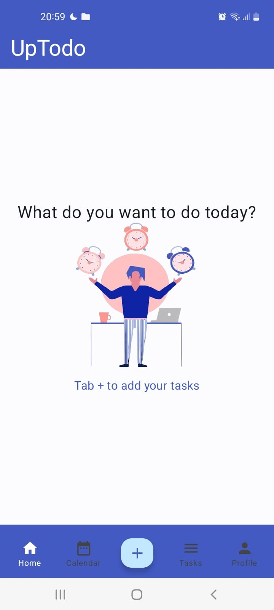
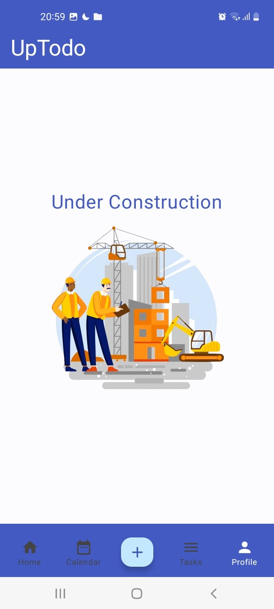
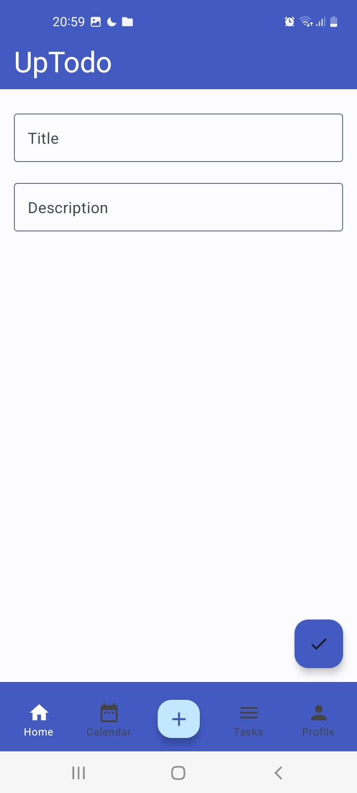
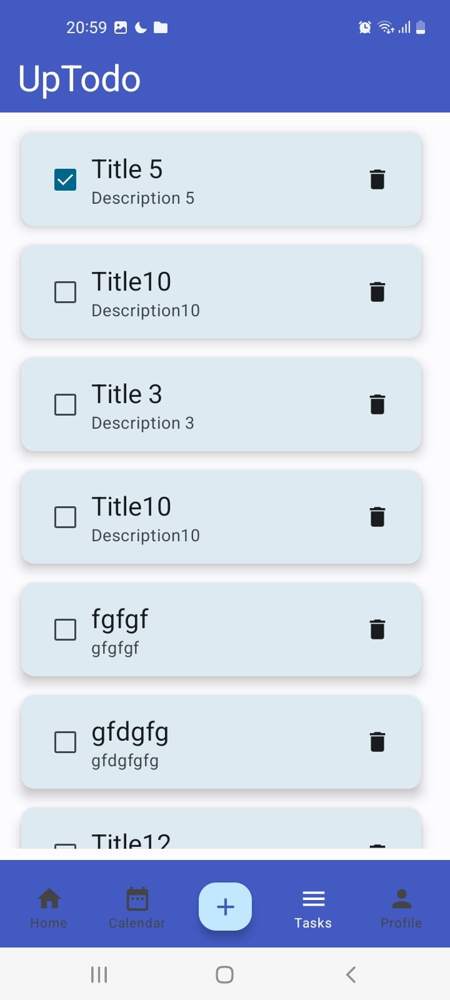

# UpTodo - Kotlin Jetpack Compose Firestore Todo List App

## Overview
UpTodo is a todo list app built using Kotlin, Jetpack Compose, and Firestore for the database. It utilizes Material3 design principles, Lazy Columns, and various UI components provided by Jetpack Compose. The app is developed in Android Studio.

## Features
- Add, edit, and delete tasks
- Mark tasks as completed
- View task details
- Profile page to manage user information

## Technologies Used
- Kotlin
- Jetpack Compose
- Firestore (for database)
- Android Studio

## UI Components
- Material3 design
- Lazy Columns
- Floating Button
- Scaffold
- TopAppBar
- BottomAppBar

## Screenshots

### Home Page

- Android Studio

## UI Components
- Material3 design
- Lazy Columns
- Floating Button
- Scaffold
- TopAppBar
- BottomAppBar

## Screenshots

## Home Page

## Profile Page

## Add Task

## List of Tasks

